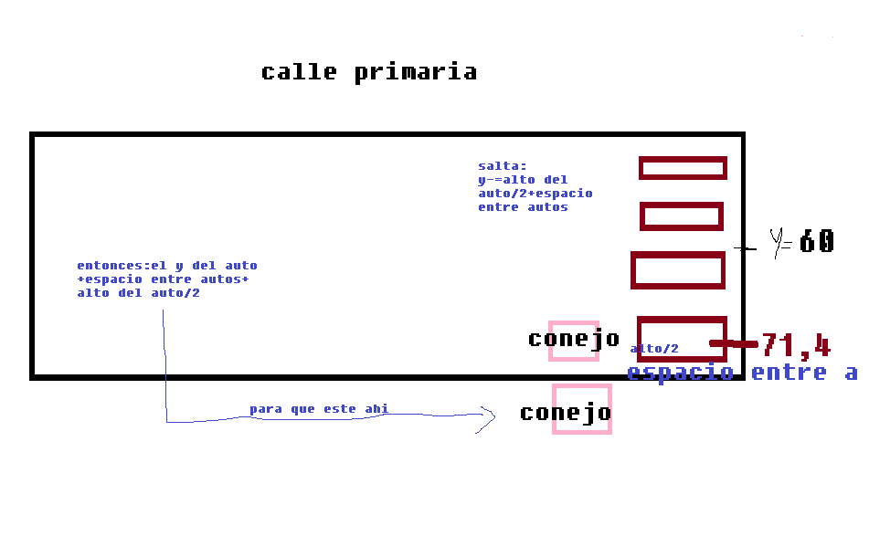
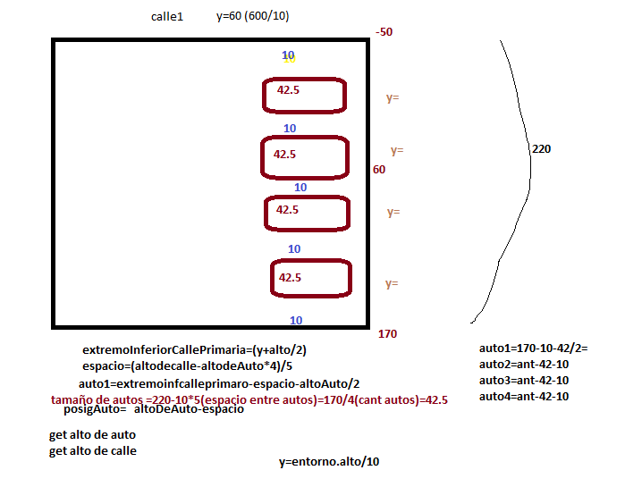

= Programación 1: Trabajo Práctico 
Sofia Alcaraz <sofiialcaraz16@gmail.com>; Pablo Pagano <pablopagano1996@gmail.com>; Jose_Luis Villacorta <jossevillacorta@gmail.com>; 
v1, {docdate}. Docentes Hernán Rondelli y Verónica Moyano (COM-01)
:title-page:
:numbered:
:toc:
:source-highlighter: coderay
:tabsize: 4

== Introducción

El Consejo Órganico Normativo y Ético para la Juventud Organizada (CONEJO), en el marco de su campaña de seguridad vial, nos solicitó el desarrollo de un video juego para ayudar a que niños y niñas tomen conciencia acerca de la seguridad vial y del respeto a las normas de transito. Para ello, nos encargaron un video juego similar al clásico Frogger, pero con algunas diferencias que mencionaremos a continuación.

El conejo ninja vivía en la luna y bajó al planeta tierra para conocerlo, por este motivo no sabe cuales son las normas de tránsito, y por ende, no sabe cruzar la calle.
El objetivo del juego es hacer que el conejito pueda cruzar las calles sin que lo atropelle ningún vehículo. Si un vehículo 
atropella al conejito, perdemos el juego.

Cabe aclarar, que en nuestro juego los vehículos y las calles se desplazan constantemente hacia abajo de la pantalla, creando la ilusión de avance del juego. Es decir, el conejo debe saltar hacia adelante para que no desaparezca por el borde inferior de la pantalla (cuando esto último sucede se pierde el 
juego).

== Descripción

=== Aspectos generales

Para realizar el juego, creamos las clases: `Conejo`, `Auto`, `Rasengan`, `Calle` y `Menu`.

- Las primeras 4 clases tienen en común los métodos `dibujar()`, `mover()`, y en el caso de la clase `Auto`, se llama `avanzar()`.

 * Clase `Calle`: Ésta cuenta con su método `dibujar()`, `deslizarHaciaAbajo()`, `posicionVertical()`(get y) y un `getLargo()`.

 * Clase `Auto`: Cuenta con su método `dibujar()`, `avanzar` y los getters de `getX()`, `getY()`, `getAltura()`, `getAncho()` y `getVelocidad()`.

 * Clase `Rasengan`: Cuenta con su método `dibujar()`, `mover()`, `salisteDepantalla()`, `colisionasteConAuto()`.

 * Clase `Conejo`: Cuenta con los métodos `dibujar()`, `esperar()`, `saltar()`, `saltarIzquierda()`, `saltarDerecha()`, `disparar()`, `seFueDePantalla()` y `chocasteAlgunAuto()`.

Decidimos crear sólo dos calles, cada una de estas con cuatro carriles y un rasengan por pantalla.

Sólo se puede jugar con las teclas de flecha `arriba` ó `w`, y flechas `laterales` ó `a`, `d`, y tecla `espaciadora` para los disparos. 

El juego cuanta con un menú que da la opción de jugar o salir. También en cualquier momento de la partida el juego
puede pausarse con la tecla `p`.

=== Funcionamiento general del juego

El juego comienza con un menú que tiene dos opciones: jugar y salir; En cualquier momento de la partida ésta se puede pausar,
en caso de perder se mostrara una pantalla "game over" con la opción de salir y en caso de ganar se mostrara una pantalla "fin del juego".

=== Conejo

Crear al conejo, darle movimiento, enseñarle a dibujarse y a saltar no fue una dificultad.

Para lograr que el conejo salte a la mitad de la calle cambiamos el método `saltar()`.
Lo que hicimos fue restarle a su `tamaño.y` el  `altoAuto / 2 + espacioEntreAutos`.

Además debiamos crear al conejo en una posición coherente para que el método saltar funcione correctamente.
Para esto al crear el conejo le pasamos por parámetro en su `y` la `(posicionPrimerAutoCallePrimaria + espacioEntreAutos + altoDelAuto / 2) * 3`, de esta forma el conejo se posicionaría al comenzar la calle y saltaría el espacio entre autos más la mitad del alto del auto, la multiplicación por tres es para que el conejo se cree con una determinada distancia respecto de la primera calle. 

.Imagen planificacion salto de conejo

=== Calle

La creamos le enseñamos a que se dibuje y deslice.

=== Auto

Para crear los autos en cierta posición realizamos un dibujo en base a la calle primaria(figura 2).
Tuvimos problemas con cómo estaba implementado el código de los for en los que se creaban los autos, ya que mezclabamos calles, sentidos y posiciones.

Para solucionarlo cambiamos los for anteriores a un for por calle con dos sentidos y cuatro carriles.
Luego pudimos hacer que estos se muevan en sincronía.

.Imagen planificación en de reaparición de autos de callePrimaria

=== Rasengan y colisión Autos

Para hacer al rasengan creamos un método `disparar()` en la clase `Conejo` el cual devuelve un nuevo rasengan con la `x` e `y` del conejo.

Luego en la clase `Juego` hicimos varios condicionales.
Uno de ellos pregunta la tecla presionada. Si rasengan es null agrega el rasengan del obtenido del metodo `disparar()` al rasengan de juego.

Luego otro condicinal analiza si este se fue de la  pantalla (si es asi lo vuelve null).

Y otro que analiza si el rasengan es distinto de null
y de serlo el rasengan se debe `dibujar()` y ` mover()`.

Para analizar la colisión con cada auto creamos dos for (uno por cada "calle con autos") con un if cada uno, que pregunta: si un auto en cierta posición es null, si colisionó con rasengan y de que sentido es.

Para analizar la colisión con cada auto creamos dos for (uno por cada calle con autos) con un if cada uno, que pregunta
si el auto en cierta posición no es null, colisionó con rasengan y de que sentido es.

Si colisionó entonces se crea un nuevo auto en la posición `y` de cada auto por defecto, y a la posición `x` se le resta o suma, según su sentido, el ancho de pantalla para que reaparezca en su posición por defecto.

Si el rasengan colisionó con algún auto, el auto y el rasengan se eliminan, el puntaje sube y se agrega un nuevo auto en la posición del arreglo donde estaba el auto eliminado, con otra posición en `x`, para que la calle no se quede sin autos.

=== Reaparición vertical Auto

Luego de hacer esto, los autos que reaparecían se seguían superponiendo, ya que el método `avanzar()` de la
clase `Auto` estaba mal (no se creaban en su posición por defecto).

Para que esto funcione correctamente, utilizamos el ancho del entorno `Entorno` y le enseñamos al Auto que al llegar al extremo tiene que reaparecer en su posición por defecto en la pantalla de arriba (la que no se ve).

=== Reaparición horizontal Autos y Calles

Para que estos reaparezcan sin dificultades  cambiamos los métodos `avanzar()`, en clase Auto y `deslizarHaciaAbajo()`, en clase Calle.

Luego de llegar a la parte de arriba es decir su `y - largo / 2` en la clase `Calle` y en la clase `Auto` su `y - ancho / 2`, estos vuelven a su posición por defecto en la pantalla de arriba  ( la que no se ve).

Esto lo logramos pasandole por parametro un entorno de tipo `Entorno` y a sus variables `y` le restamos `entono.alto()*2` 
de esta forma aparecen en la posición que inicialmente se les había asignado.

=== Conejo y calle

El conejo saltaba fuera de los carriles.

Para corregir esto, lo que hicimos es hacer cálculos con la posición en `y` del primer auto de la parte inferior 
de la primera calle, su alto y los espacios entre autos.

Tratando de que el `y` del conejo sea casi el mismo que
el del auto. 

Luego modificamos el método `saltar()` pasándole por parámetro un entorno de tipo Entorno, el `altoDelAuto` y el `espacioEntreAutos` de esta forma el conejo salta `altoAuto / 2 + espacioEntreAutos` y a pesar de hacer mini saltos, cae 
dentro de la calle. 
 
Es importante aclarar que solo el salto hacia adelante `saltar()` es el que toma todos estos parámetros ya que el
`x` del conejo no tiene los mismos problemas que el `y` y los demás saltar trabajan con el `x`.

=== Menú

La clase `Menú` fue creada para que haya una instancia previa a que el juego comience, esta consta de dos botones y un cursor que muestra la opción que se quiera elegir.

Otra funcionalidad del `Menú`, fue poder ser utilizado como botón de pausa dentro del juego. 

La dificultad que nos presentó y a la cuál no encontramos solución, fue pedirle al `Menú` que vuelva a comenzar el juego sin cerrar el entorno.

=== Otros

Para hacer que todo se deslice hacia abajo al mismo tiempo le pasamos por parámetro, a todos los objetos que debían 
deslizarse, una misma constante llamada: `velocidadDeBajadaDePantalla` ( que se encuentra en la clase `Juego`).

Para poder mostrar texto por pantalla lo que tuvimos que utilizar fue `Integer.toString(algunInt)` para transformar los enteros en `String` ya que el método: `entorno.cambiarFont` y `entorno.escribirTexto` lo requerían así.

== Implementación

En esta sección se incluye el código fuente y una breve descripción de cada clase y los métodos utilizados.

En general el método `dibujarse()` toma por parámetro a un entorno de tipo `Entorno`, es void y solo dibuja la imagen que se indique en el constructor ( a excepción del método `dibujarse()` en la clase `Conejo` que se explicara más adelante).

.Clase Conejo
[source,java]
----
include::src/juego/Conejo.java[]
----

La clase `Conejo` tiene:

- Como estado propio: tamaño, `velocidadDeSalto`( movimiento vertical y horizontal), `deslizarHaciaAbajo` ( deslizamiento hacia abajo) y las imagénes.

- Como comportamiento: el conejo se sabe, `dibujar()`, `saltar()`, `esperar()`, `saltarIzquierda()`, `saltarDerecha()`, `disparar()`, `seFueDePantalla()`, `chocasteAlgunAuto()`.

 * El método `dibujar()` es particular, ya que dibuja la imagen según que movimiento hizo anteriormente, lo cúal se indica en los métodos de salto.

 * El método `saltar()` es de tipo void, toma por parámetro a un entorno de tipo `Entorno` y lo que hace realiza es el efecto de salto hacia adelante restandole al `tamaño.y` la `velocidadDeSalto`.
 También impide que el conejo de vaya de la pantalla por la parte superior.

 * El  método `saltarDerecha()` es de tipo void, toma por parámetro a un entorno de tipo `Entorno` y realiza el efecto de salto hacia la derecha sumandole a la `tamaño.x` la `velocidadDeSalto`.
 También impide que el conejo se vaya de la pantalla por el lateral derecho.

 * El método `saltarIzquierda()` es de tipo void, toma por parámetro a un entorno de tipo `Entorno` y lo que hace realizar el efecto de salto hacia la izquierda restandole a la `tamaño.x` la `velocidadDeSalto`.
 También impide que el conejo se vaya de la pantalla por el lateral izquierdo.

 * El método `esperar()` es de tipo void y lo que hace es sumarle a `tamaño.y` el `deslizarHaciaAbajo`, de esta forma, si el conejo esta quieto se deslizará hacia abajo.

 * El método `disparar()` devuelve un `Rasengan` con su `tamaño.x` e `tamaño.y` correspondientes (la posición actual del conejo a la hora de disparar).
 
 * El método `seFueDePantalla()` es de tipo boolean y lo que hace es revisar si el conejo se fue de la pantalla por la parte inferior, es decir, si su `tamaño.y + tamaño.altura / 2 < entorno.alto()`  entonces el método devuelve true, caso contrario, false.

 * El método `chocasteAlgunAuto()` es de tipo boolean y toma por parámetro un array de autos, si el conejo colisiona con alguno de estos autos, devuelve true, sino false.
 
.Clase Auto
[source,java]
----
include::src/juego/Auto.java[]
----
La clase `Auto` tiene:

- Como estado propio: `alto`, `ancho`, `x`, `y`, `velocidad`( movimiento horizontal),`sentido` ( true es derecha-izquierda y false de izquierda-derecha), `bajadaDePantalla` ( mov vertical) y la imagen.

-Como comportamiento propio: el auto sabe `dibujarse()` y `avanzar()`, también cuenta con los getters de todos sus estados que son utilizados para crear los autos luego de ser 
destruidos por algún rasengan.

 * El método `avanzar()` es de tipo void, hace que el auto avance para cierto lado según su `sentido`, sumando o restando a su `x` la velocidad.
 Tambien esta constantemente aumentando su `y` sumandole la `bajadaDePantalla` ( que es la velocidad con la que se desliza
 hacia abajo el auto). Y en caso de llegar al extremo contrario se encarga de hacerlo reaparecer en su posición por defecto ( en la pantalla que no se ve).
   

.Clase Calle
[source,java]
----
include::src/juego/Calle.java[]
----

La clase `Calle` tiene:

- Como estado propio: `largo`, `x`, `y`, `factorDeDesplazamiento` y su imagen.

- Como comportamientos propios: sabe `dibujarse()` y `deslizarseHaciaAbajo()`, tambien cuenta con dos getters: `getLargo()` y `getPosicionVertical()`.

 * El método `deslizarseHaciaAbajo()` es de tipo void, toma     
  por parámetro a un entorno de tipo `Entorno` y lo que hace 
  es sumar al `y` el `factorDeDesplazamiento` (que es la rapidez con la que se desliza la pantalla).
  También hace que reaparezca la calle cuando pasa el borde inferior.

.Clase Rasengan
[source,java]
----
include::src/juego/Rasengan.java[]
----

La clase `Rasengan` tiene:

- Como estado propio: `x`, `y`, `velocidad`, `diametro` y la imagen.

- Como comportamiento propio: se sabe `dibujar()`, `mover()`,    `salisteDePantalla()` y  `colisionasteConAuto()`.

 * El método `mover()` es de tipo void y lo que hace es restarle al `y` la `velocidad` (creando el efecto de que se mueve hacia arriba).

 * El método `salisteDePantalla()` es de tipo boolean y revisa si  "y + diametro" es menor a 0 entonces el rasengan se salio del lado superior de la pantalla.

 * El método `colisionasteConAuto()` es de tipo boolean y revisa si el rasengan colisionó con algún lado del auto pasado por parámetro, si colisionó entonces devuelve true, caso contrario devuelve false.

.Clase Menu
[source,java]
----
include::src/juego/Menu.java[]
----

La clase `Menu` tiene:

- Como estado propio: `posicionDelBotonJugarX`,`posicionDelBotonJugarY`, 
`posicionDelBotonSalirX`, `posicionDelBotonSalirY`, `posicionDelCursorX`, `posicionDelCursorY`, y dos imagenes
que son botonJugar y botonSalir.

- Como comportamiento propio: sabe `dibujarse()` y tiene dos    métodos importantes para su funcionamiento: 
`actualizarCursorYconFechas()`, `confirmarSeleccionado()`.

 * El método `actualizarCursorYconFechas()`,es de tipo void y lo que hace es actualizar el `posicionDelCursorY` tomando un boolean que depende de que tecla se presione en juego.

 * El método `confirmarSeleccionado()` es de tipo String y según 
 la posición del `posicionDelCursorY` devuelve un String con la acción que se quiere realizar y si no es ninguna de las opciones disponibles devuelve un String vacío.

.Clase Juego
[source,java]
----
include::src/juego/Juego.java[]
----

===== Juego

En el constructor inicializamos los objetos y todo lo necesario para que el juego funcione.

Para los autos de cada calle hicimos dos for diferentes.
Cada array de calle con autos (callePrimaria o calleSecundaria) tiene un length() ==16, en cada for se recorre el array y agrega autos en cada posición.

Cada for cuenta con tres if y un else. El primer if agrega cuatro autos en el carril inferior  que van de izquierda-derecha, el segúndo agrega cuatro autos que van de derecha-izquierda, el tercer if agrega cuatro autos que van de izquierda-derecha y el else agrega cuatro autos que van de  derecha-izquierda.

El segúndo for es parecido, aunque decidimos que el `sentido` de los autos empiece de forma diferente.
Segun su sentido los autos se crean en determinado `x` (cero o el `entorno.ancho()`).

Para la posición en `y` hicimos varias cuentas matemáticas teniendo en cuenta la calle y la posición del primer auto(adjuntamos un dibujo en descripción).

.Variables de creacion de autos.
[source, java]
----
public class Juego() {
    extremoInferiorCallePrimaria = entorno.alto() / 10 + altoDeLaCalle / 2;
		extremoInferiorCalleSecundaria = entorno.alto() / 10 * -9 + altoDeLaCalle / 2;
		espacioEntreAutos = (altoDeLaCalle - (altoDelAuto * 4)) / 5;
		posicionPrimerAutoCallePrimaria = extremoInferiorCallePrimaria - espacioEntreAutos - altoDelAuto / 2;
		posicionDelSiguienteAuto = espacioEntreAutos + altoDelAuto;
		posicionDelPrimerAutoCalleSecundaria = extremoInferiorCalleSecundaria - espacioEntreAutos - altoDelAuto / 2;
}
----

- En esta parte del código se realizan calculos para la creacion de autos.

 * En `extremoInferiorCallePrimaria` el "/10" es para obtener el `y` de la calle, lo mismo ocurre con `extremoInferiorCalleSecundaria`.

 * En `espacioEntreAutos` el "4" es por la cantidad de carriles y el "/5" es por la cantidad de espacios necesarios.
Adjuntamos una foto en la sección descripción.
 
===== tick

El esta parte al principio creamos un if que pregunta si la partida esta corriendo, en caso ser falso entonces se pregunta si la partida esta perdida, ganada o en pausa y según que condición se cumple realiza cierta opción.

En caso de que la partida este corriendo  se dibuja todo, se llama a los métodos  necesarios, se revisan las colisiones. 

== Conclusiones

El trabajo nos ayudo a terminar de entender como es el manejo de objetos con Java, los arrays de objetos, sus constructores, métodos, variables, constantes, etc.

Tambien aprendimos que antes de comenzar a programar es muy importante planear cuales Objetos, variables y métodos
necesitamos y como estos se relacionan entre si.

Creemos que el pensar mucho el nombre de las variables nos va a quedar para siempre y que hay miles de formas de escribir el código. 
Además aprendimos que el orden en que se ejecuta el código es muy importante.
No nos terminó de gustar el código a la hora de crear Autos en el juego y nos hubiese gustado agregarle mas cosas, pero tuvimos muy poco tiempo. 
Aprendimos algo muy útil, que es el manejo de git, que además de todo lo que aprendimos de la materia, nos llevamos todos estos conocimientos que van a ser útiles en el futuro y nos acercan a lo que es un "verdadero" proyecto en equipo.

Gracias al trabajo se puede vivenciar los primeros pasos en nuestra formación como profesionales de la informática y la programación.

Un equipo de trabajo unido y en sintonía siempre va a funcionar mejor que un grupo de desarrolladores trabajando solos. Las ventajas de esto es saber cuáles son las fortalezas y debilidades de los otros, de este modo, nuestros aportes al proyecto se van a acomodar de tal forma que cada uno hará lo que más le gusta y mejor le sale, y de esta forma el resultado va a ser muchos mas enriquecedor, con menos stress para todos y mas gratificante para todos.
